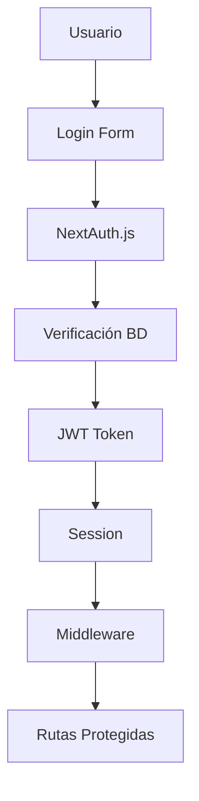
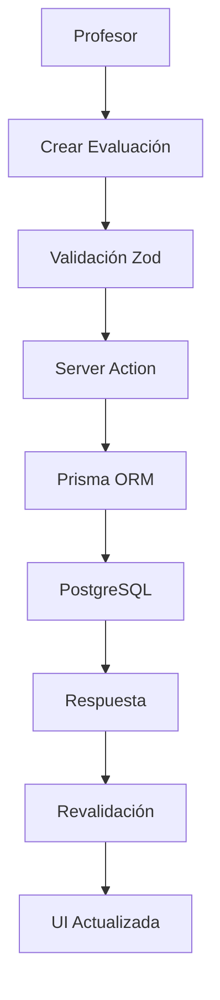
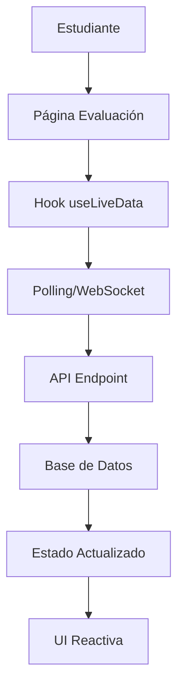

# Arquitectura Técnica - SEIA

## Descripción General

SEIA (Sistema de Evaluaciones Inteligentes Académicas) es una aplicación web moderna construida con Next.js 14, que utiliza las últimas características del framework para proporcionar una experiencia de usuario fluida y un rendimiento óptimo.

## Stack Tecnológico

### Frontend
- **Framework**: Next.js 14 con App Router
- **Lenguaje**: TypeScript
- **Estilos**: Tailwind CSS
- **Componentes UI**: Shadcn/ui
- **Iconos**: Lucide React
- **Formularios**: React Hook Form + Zod
- **Estado**: React Context + Hooks personalizados

### Backend
- **Runtime**: Node.js
- **API**: Next.js API Routes (App Router)
- **Autenticación**: NextAuth.js v5
- **Base de Datos**: PostgreSQL
- **ORM**: Prisma
- **Validación**: Zod
- **Encriptación**: Crypto (Node.js nativo)

### Infraestructura
- **Hosting**: Vercel
- **Base de Datos**: Supabase/Railway
- **CDN**: Vercel Edge Network
- **SSL**: Automático (Vercel)
- **Dominio**: Configuración personalizada

## Arquitectura de la Aplicación

### Estructura de Directorios

```
src/
├── app/                          # App Router (Next.js 14)
│   ├── (auth)/                   # Grupo de rutas de autenticación
│   ├── admin/                    # Panel de administración
│   ├── teacher/                  # Panel de profesores
│   ├── student/                  # Área de estudiantes
│   ├── api/                      # API Routes
│   ├── globals.css               # Estilos globales
│   ├── layout.tsx                # Layout principal
│   └── page.tsx                  # Página de inicio
├── components/                   # Componentes reutilizables
│   ├── ui/                       # Componentes base (shadcn/ui)
│   ├── admin/                    # Componentes específicos de admin
│   ├── teacher/                  # Componentes específicos de profesores
│   └── shared/                   # Componentes compartidos
├── hooks/                        # Hooks personalizados
├── lib/                          # Utilidades y configuraciones
├── types/                        # Definiciones de tipos TypeScript
└── utils/                        # Funciones utilitarias
```

### Patrones de Diseño Implementados

#### 1. **Server Components + Client Components**
```typescript
// Server Component (por defecto)
export default async function AdminPage() {
  const users = await getUsers(); // Fetch en servidor
  return <UsersList users={users} />;
}

// Client Component (interactividad)
'use client';
export function UsersList({ users }: { users: User[] }) {
  const [filter, setFilter] = useState('');
  // Lógica de cliente...
}
```

#### 2. **Server Actions**
```typescript
// actions.ts
'use server';
export async function createUser(formData: FormData) {
  const validatedData = userSchema.parse(formData);
  return await prisma.user.create({ data: validatedData });
}
```

#### 3. **Middleware para Protección de Rutas**
```typescript
// middleware.ts
export function middleware(request: NextRequest) {
  const token = request.nextUrl.pathname;
  
  if (token.startsWith('/admin')) {
    return withAuth(request, ['ADMIN']);
  }
  
  if (token.startsWith('/teacher')) {
    return withAuth(request, ['ADMIN', 'TEACHER']);
  }
}
```

## Flujo de Datos

### 1. **Autenticación y Autorización**



### 2. **Gestión de Evaluaciones**



### 3. **Monitoreo en Tiempo Real**



## Componentes Clave

### 1. **Sistema de Autenticación**

```typescript
// lib/auth.ts
export const authOptions: NextAuthOptions = {
  providers: [
    CredentialsProvider({
      async authorize(credentials) {
        const user = await validateUser(credentials);
        return user ? { ...user, role: user.role } : null;
      }
    })
  ],
  callbacks: {
    jwt: ({ token, user }) => ({ ...token, ...user }),
    session: ({ session, token }) => ({ ...session, user: token })
  }
};
```

### 2. **Validación de Datos**

```typescript
// lib/validations.ts
export const evaluationSchema = z.object({
  title: z.string().min(1, "Título requerido"),
  description: z.string().optional(),
  questions: z.array(questionSchema),
  teacherId: z.number(),
  schedules: z.array(scheduleSchema)
});
```

### 3. **Hooks Personalizados**

```typescript
// hooks/useLiveData.ts
export function useLiveData<T>(endpoint: string, interval = 5000) {
  const [data, setData] = useState<T | null>(null);
  const [loading, setLoading] = useState(true);
  
  useEffect(() => {
    const fetchData = async () => {
      const response = await fetch(endpoint);
      const result = await response.json();
      setData(result);
      setLoading(false);
    };
    
    fetchData();
    const intervalId = setInterval(fetchData, interval);
    
    return () => clearInterval(intervalId);
  }, [endpoint, interval]);
  
  return { data, loading };
}
```

## Seguridad

### 1. **Protección de Rutas**
- Middleware de autenticación
- Verificación de roles por ruta
- Tokens JWT seguros
- Sesiones encriptadas

### 2. **Validación de Datos**
- Esquemas Zod en cliente y servidor
- Sanitización de entradas
- Protección contra inyección SQL (Prisma)
- Validación de tipos TypeScript

### 3. **Seguridad de API**
- Rate limiting
- CORS configurado
- Headers de seguridad
- Encriptación de datos sensibles

## Optimizaciones de Rendimiento

### 1. **Next.js 14 Features**
- **App Router**: Routing optimizado
- **Server Components**: Renderizado en servidor
- **Streaming**: Carga progresiva
- **Suspense**: Loading states automáticos

### 2. **Base de Datos**
- **Prisma**: Queries optimizadas
- **Índices**: En campos frecuentemente consultados
- **Connection Pooling**: Gestión eficiente de conexiones
- **Caching**: Estrategias de cache implementadas

### 3. **Frontend**
- **Code Splitting**: Carga bajo demanda
- **Image Optimization**: Next.js Image component
- **CSS Optimization**: Tailwind CSS purging
- **Bundle Analysis**: Monitoreo de tamaño

## Monitoreo y Logging

### 1. **Métricas de Aplicación**
- Tiempo de respuesta de API
- Uso de memoria y CPU
- Errores de aplicación
- Métricas de usuario

### 2. **Logging Estructurado**
```typescript
// lib/logger.ts
export const logger = {
  info: (message: string, meta?: object) => {
    console.log(JSON.stringify({ level: 'info', message, meta, timestamp: new Date() }));
  },
  error: (message: string, error?: Error) => {
    console.error(JSON.stringify({ level: 'error', message, error: error?.stack, timestamp: new Date() }));
  }
};
```

### 3. **Alertas y Notificaciones**
- Errores críticos
- Picos de tráfico
- Fallos de base de datos
- Problemas de rendimiento

## Escalabilidad

### 1. **Horizontal Scaling**
- Vercel Edge Functions
- CDN global
- Load balancing automático
- Auto-scaling basado en demanda

### 2. **Database Scaling**
- Read replicas
- Connection pooling
- Query optimization
- Índices estratégicos

### 3. **Caching Strategy**
- Next.js caching
- Database query caching
- Static generation
- Edge caching

## Desarrollo y Despliegue

### 1. **Flujo de Desarrollo**
```bash
# Desarrollo local
npm run dev          # Servidor de desarrollo
npm run build        # Build de producción
npm run start        # Servidor de producción
npm run lint         # Linting
npm run type-check   # Verificación de tipos
```

### 2. **CI/CD Pipeline**
- **GitHub Actions**: Automatización
- **Vercel**: Despliegue automático
- **Preview Deployments**: Testing de branches
- **Production Deployments**: Desde main branch

### 3. **Configuración de Entornos**
```bash
# Desarrollo
NODE_ENV=development
DATABASE_URL=postgresql://localhost:5432/seia_dev

# Producción
NODE_ENV=production
DATABASE_URL=postgresql://prod-host:5432/seia_prod
```

## Próximas Mejoras Técnicas

### 1. **Performance**
- Implementar React Server Components avanzados
- Optimizar queries con DataLoader pattern
- Implementar caching más agresivo
- Migrar a Edge Runtime donde sea posible

### 2. **Funcionalidades**
- WebSockets para tiempo real
- PWA capabilities
- Offline support
- Push notifications

### 3. **Infraestructura**
- Microservicios para funcionalidades específicas
- Event-driven architecture
- Message queues para tareas pesadas
- Monitoring avanzado con APM

---

**Última actualización**: Enero 2025  
**Versión de la arquitectura**: 2.0  
**Estado**: Estable y en producción